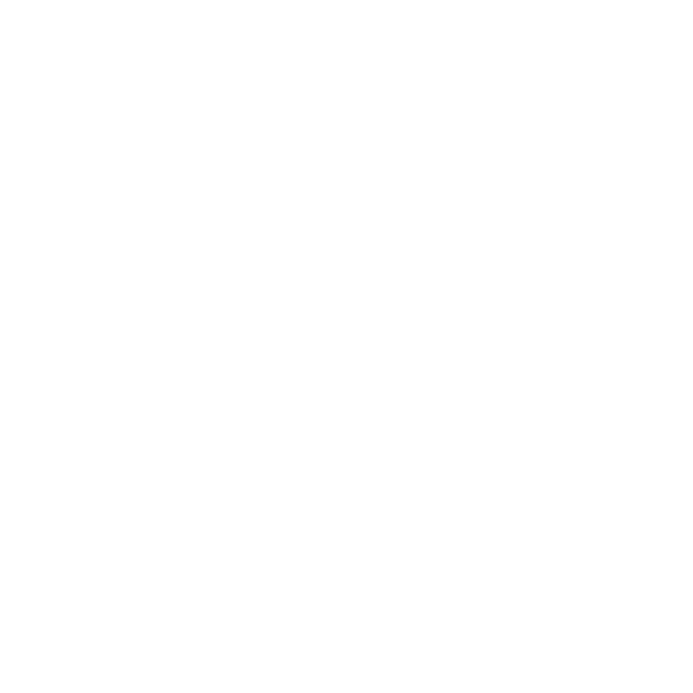
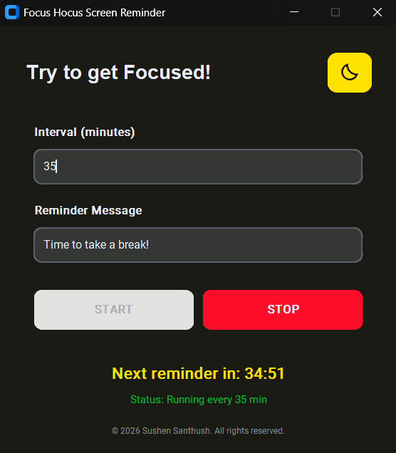

  
  
<b>Magically transforming your screen time habits.</b>

  
  
  

---

## 🚀 Overview
**Focus Hocus** is a professional-grade productivity utility designed to protect eye health and optimize focus. Created and developed by **Sushen Santhush**, it provides a modern, intuitive interface for managing screen time.

## ✨ Features
* **Modern UI:** Built with CustomTkinter for a sleek Windows 11 look.
* **Theme Engine:** Seamless switching between Light and Dark modes.
* **Smart Notifications:** Uses system-level alerts to minimize distractions.
* **One-Click Install:** Distributed via a professional Windows Installer.

* 

  
  
<i>The sleek, modern interface of Focus Hocus in action.</i>

## 📦 Installation
1.  Navigate to the [Releases](../../releases) tab.
2.  Download the latest `FocusHocus_Setup.exe`.
3.  Run the installer (accepting the User License Agreement).
4.  Launch Focus Hocus from your Desktop shortcut.

## ⚖️ Legal & Copyright
**Copyright © 2026 Sushen Santhush. All Rights Reserved.**

This software is **Proprietary**. You are permitted to view the source code for educational purposes. However, the following actions are strictly prohibited without written consent from the author:
* Redistribution of the source code or binaries.
* Commercial use or resale.
* Modification or derivative works.

*Unauthorized use or duplication is a violation of international copyright laws and is punishable by law.*

---
**Author:** [Sushen Santhush](https://github.com/SushenSanthush)
